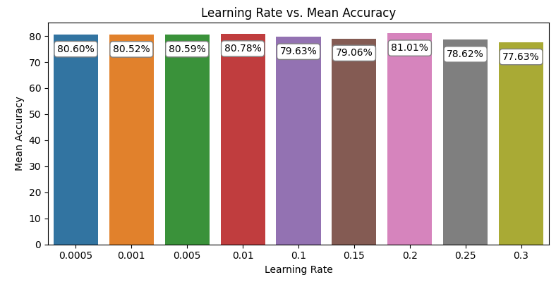
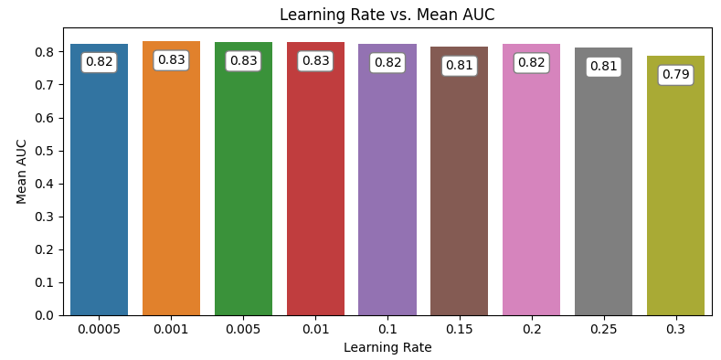
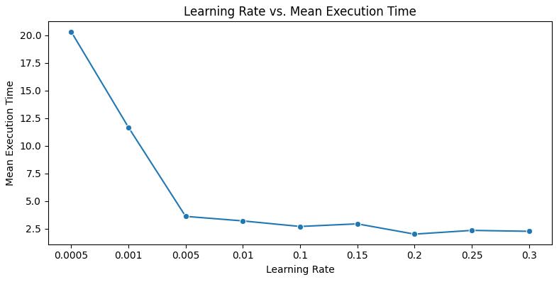
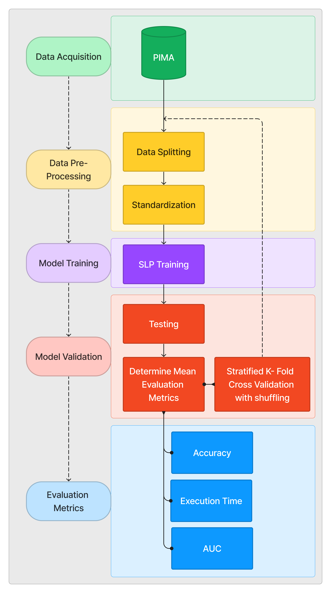

<!-- ABOUT THE PROJECT -->
## About The Project
This is a repository for implementing, describing, and testing a Single Layer Perceptron for predicting diabetes. The results are in form of a short conference paper.
I achieved an accuracy of 80.58%. In the project i used 5 fold cross validation with shuffling for determining the ideal learning rate. I used the [PIMA Indians dataset](https://www.kaggle.com/datasets/uciml/pima-indians-diabetes-database)
.The training was evaluated using evaluation metrics such as Accuracy, Execution and AUC on various learning rates. For a detailed analysis of the results, please refer to [paper]() & [code](). Below are some of the results from the paper.

  
  
  

<!-- OVERVIEW -->
## Overview
We use a very basic implementation of SLP([Single Layer Perceptron](https://en.wikipedia.org/wiki/Perceptron)) in classifying if the patient
is diabetic or not.

<!-- FLOWCHART -->
## General Flowchart for the project 

  

<!-- REIMPLEMENTATION -->
## Implementing
The project is implemented using a jupyter notebook, so its fairly straightforward to download it directly to retest. [Notebook]()

<!-- Dependencies -->
## Dependencies
The code utilizes the python packages as such 
* matplotlib, 
* seaborn, 
* pandas, 
* numpy, 
* scikit-learn,
* Tensorflow.

<!-- LICENSE -->
## License

Distributed under the MIT License. See `LICENSE` for more information.

<!-- Authors -->
## Authors
Project Link:
 ~~Kaggle Notebook:~~ 
 ~~Collab Notebook:~~ 

## Thank you

<picture>
  <source media="(prefers-color-scheme: dark)" srcset="https://user-images.githubusercontent.com/25423296/163456776-7f95b81a-f1ed-45f7-b7ab-8fa810d529fa.png">
  <source media="(prefers-color-scheme: light)" srcset="https://user-images.githubusercontent.com/25423296/163456779-a8556205-d0a5-45e2-ac17-42d089e3c3f8.png">
  
</picture>

> [!NOTE]
> This is part of the Assignment of COMP SCI 7318 - Deep Learning Fundamentals, University of adelaide, ~~which had the worst Teaching assistants imo :vomiting_face:~~. 